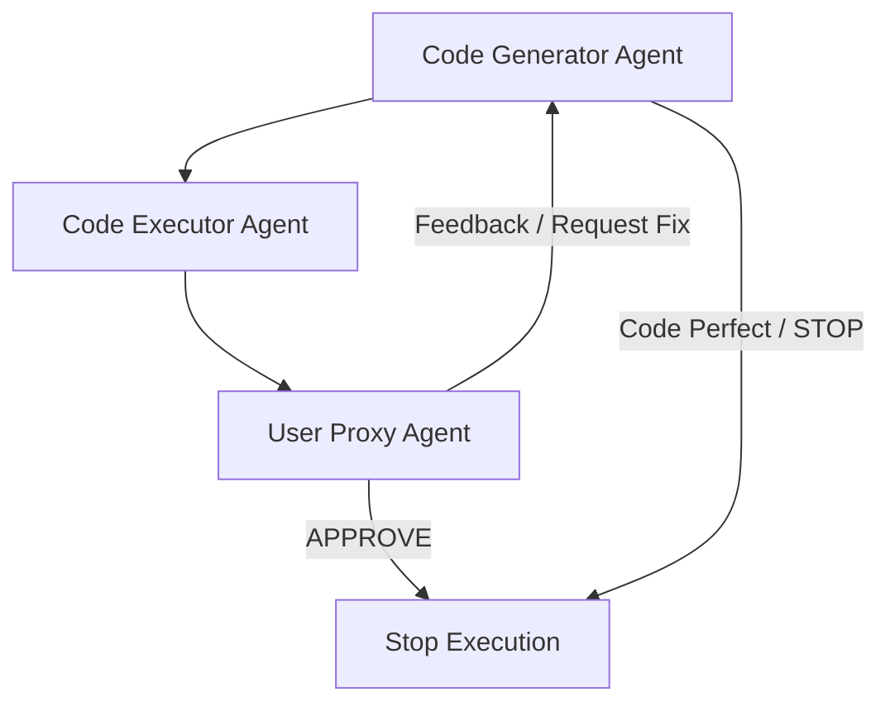

# 🧐 Multi-Agent Code Generation and Execution Framework

This project is built using [AutoGen](https://github.com/microsoft/autogen) — a powerful framework to orchestrate multi-agent conversations. The system uses a team of agents to handle **code generation**, **code execution via Docker**, and return the **final output to the user**.

---

## 🔧 Features

- Multi-agent orchestration using AutoGen
- Code generation powered by LLMs
- Docker-based code execution in a secure environment
- Modular and extensible agent design

---

## 📁 Project Structure

```
🔹 agents/
│   ├── user_proxy_agent.py         # Handles user feedback and approves or rejects code
│   ├── code_generator_agent.py     # Agent responsible for generating Python code using LLMs
│   └── code_executor_agent.py      # Executes the generated code securely in Docker

🔹 utils/
│   └── docker_utils.py             # Utilities for Docker management and execution

🔹 teams/
│   └── software_development_team.py # Round-robin group chat coordination logic

🔹 main.py                           # Main entry point: initializes the team and starts the interaction
🔹 requirements.txt
🔹 README.md
```

---

## 🔄 Agent Workflow



---

## 🚀 Getting Started

### Prerequisites

- Python 3.9+
- Docker installed and running
- OpenAI or other LLM API key configured (for AutoGen)

### Installation

1. **Clone the repository**

```bash
git clone https://github.com/your-username/multi-agent-codegen.git
cd multi-agent-codegen
```

2. **Create a virtual environment (optional)**

```bash
python -m venv venv
source venv/bin/activate  # On Windows: venv\Scripts\activate
```

3. **Install dependencies**

```bash
pip install -r requirements.txt
```

4. **Set environment variables**

Create a `.env` file or export your keys manually:

```bash
export OPENAI_API_KEY="your-openai-api-key"
```

---

### 🏃 Run the Project

```bash
python main.py
```

The agents will initiate a conversation. Provide a programming task, and the system will:

1. Understand the user request
2. Generate the appropriate Python code
3. Execute the code inside Docker
4. Return the output to the user
5. Refine until "APPROVE" or "STOP"

---

## 🧪 Example Use Case

```plaintext
User: Write a Python function to calculate the factorial of a number.

System:
✔️ Code generated by CodeGeneratorAgent
✔️ Code executed in Docker
✔️ Output: factorial(5) = 120
✔️ User approves result
```

---

## ⚙️ Customization

- **Add a new agent**: Create a new class extending `autogen.Agent` and register it in `main.py`.
- **Change execution environment**: Modify `docker_utils.py` to customize the Docker container.
- **Switch LLM providers**: Configure different LLM endpoints in the AutoGen agent setup.

---

## 📌 Roadmap

- [ ] Add support for multi-language code execution
- [ ] Integrate error recovery and retry logic for failed executions
- [ ] Store and visualize full agent conversation history

---

## 🗃️ Logs

Conversation history will be logged in your OpenAI usage dashboard:

👉 [https://platform.openai.com/logs](https://platform.openai.com/logs)

---

## 🤝 Contributing

Pull requests are welcome. For major changes, please open an issue first to discuss the proposal.

---

## 🛡️ License

MIT License

---

**Developed with ❤️ using AutoGen**